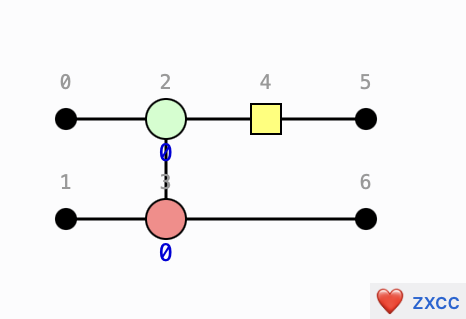
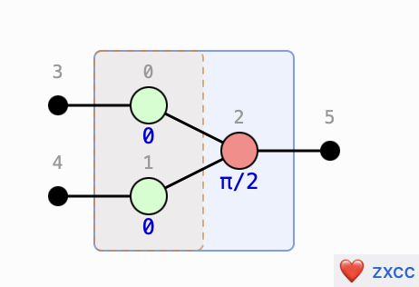

# zxcc - ZX Calculus Components

[](https://github.com/adnathanail/zxcc/actions/workflows/ci.yml)
[](https://lit.dev)
[](https://www.typescriptlang.org)
[](https://github.com/j178/prek)
[](https://storybook.js.org)

Framework-agnostic web component for rendering [ZX-calculus](https://zxcalculus.com) diagrams.




[Checkout the demo](https://main--6a7e12985acc92e6ec37bdaa.chromatic.com)

## Usage

```sh
npm install @adnathanail/zxcc
```

```html
<script type="module" src="./node_modules/@adnathanail/zxcc/dist/index.bundle.js"></script>

<zx-diagram id="d"></zx-diagram>

<script type="module">
  document.getElementById('d').diagram = {
    nodes: [
      { id: 0, type: 'input',  ioId: 0 },
      { id: 1, type: 'spider', color: 'Z', phase: 'π/2' },
      { id: 2, type: 'output', ioId: 0 },
    ],
    edges: [
      { src: 0, tgt: 1 },
      { src: 1, tgt: 2 },
    ],
  }
</script>
```

`diagram` is a JS property, not an attribute — set it via a DOM reference so the object round-trips without JSON coercion.

## Diagram shape

```ts
interface DiagramData {
  nodes: DiagramNode[]
  edges: DiagramEdge[]
  boxes?: { kind: 'stack' | 'compose'; nodeIds: number[] }[]
  labels?: [number, string][]  // node-id → phase-label override
}

interface DiagramNode {
  id: number
  type: 'spider' | 'input' | 'output' | 'hadamard' | 'wire'
  color?: 'Z' | 'X'      // spider only
  phase?: string         // pre-formatted (e.g. "π/2", "-π/4")
  ioId?: number          // input/output index
  col?: number           // optional pre-computed column
  qubit?: number         // optional pre-computed qubit row
}

interface DiagramEdge {
  src: number
  tgt: number
  kind?: 'simple' | 'hadamard' | 'w-io'   // default 'simple'
}
```

If any node carries `col`, auto-layout is skipped and every node is expected to carry both `col` and `qubit`.
Otherwise a BFS from the inputs assigns rows and qubits.

## Development

Install npm dependencies:

```sh
npm install
```

Set up pre-commit hooks ([install prek](https://github.com/j178/prek) first):

```
prek --install
```

### Demo

To view the Storybook example usages, and an interactive Playground story with controls:

```sh
npm install
npm run storybook
```

### Testing

You can run tests from inside the Storybook web interface.
If you want to run them via the terminal:

```sh
npm run test
```

And to run with coverage:

```sh
npm run coverage
```

Then open `coverage/index.html` in a browser.

### Building from source

```sh
npm run build       # tsc → dist/, then rollup bundles to dist/index.bundle.js
npm run watch       # rollup --watch (rerun tsc manually on .ts changes)
```

The bundle is self-contained with no runtime dependencies.

### Analyzing bundle composition

```sh
npm run analyze
```